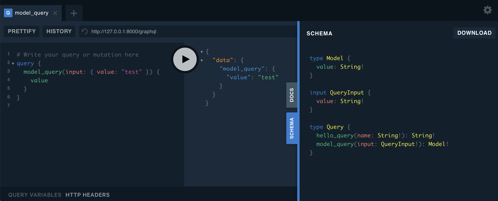

# Parameters

Of course, we expect that queries and mutation should
accept parameters, and of course, **FastGraphQL** gives
us an easy way to deal with them.

Putting semantics aside, **FastGraphQL
handles queries and mutations in the same way**
and everything we need to ensure that **all parameters
and return values have type hints**


## Heads Up!

To simplify documentation, remember that both method signatures,
`#!python FastGraphQL.query()` and `#!python FastGraphQL.mutation()`,
have the same signature and therefore we will use only
`#!python FastGraphQL.query()` in the next examples.


## Query and Mutation Parameters

This is our starting point for this section. Starting from the
following file:

```python title="main.py" linenums="1"
--8<-- "tutorial/parameters/main.py"
```

execute:

```sh
$ uvicorn main:app --reload
```

and open <a href="http://127.0.0.1:8000/graphql" target="_blank">http://127.0.0.1:8000/graphql</a>

to see something like:




## Deep-Dive :diving_mask:

### Scalar Input and Output

The first initial type of parameters is parameters using scalar types,
or python primitive types. (See [Type System and Python Types](tutorial/data-types.md))

```python title="main.py" linenums="1" hl_lines="10-12"
--8<-- "tutorial/parameters/main.py"
```

Looking into lines 10 until 12, the simplest way to define an `str`
parameter is to declare a parameter in your query or mutation method
as shown in line 11. In the same way, to define the output type
of a query or mutation, just annotate the return type of the function,
also in line 11.

### Complex Input and Output


```python title="main.py" linenums="1" hl_lines="23-25"
--8<-- "tutorial/parameters/main.py"
```

Now looking into lines 23 until 25, we can define an
input type called `QueryInput`. Note that `QueryInput` is
*pydantic* model supported by **FastGraphQL**.

In the same way, we can define an output type, which is
also *pydantic* model, called `Model`.

**FastGraphQL** allows you to define implicit GraphQL inputs and
types. Note that neither `Model` nor `QueryInput` has any decorator,
nevertheless, **FastGraphQL** understands both classes as GraphQL type
and input respectively.


### Reusing Classes

There are many circumstances in which input and output are the
same, meaning we could use the same class. This is possible with
**FastGraphQL**. Let us rewrite the code above as follows:

```python title="main.py" linenums="1" hl_lines="10 16"
--8<-- "tutorial/parameters/reuse.py"
```

Looking at line 16, we have now the same python class serving as
the input and output of this specific query. As an outcome we have:


Note that line 10 is a key aspect of this construct. This line
tells **FastGraphQL** that we want to use the `#!python class Model`
as an input named `ModelInput`. Since we are using implicit definitions,
this avoids **FastGraphQL** throwing an error telling us that
we have two GraphQL entities, one input and one type in this case,
with the same name.
