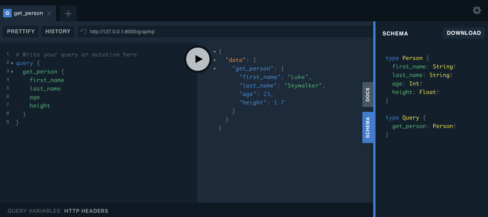

# Classes

Python classes should be defined as **Pydantic** models to be supported.

## Classes with only primitive types

Starting with a simple example,

```python title="main.py" linenums="1"
--8<-- "tutorial/simple-classes/main.py"
```

then execute,

```sh
$ uvicorn main:app --reload
```

open <a href="http://127.0.0.1:8000" target="_blank">http://127.0.0.1:8000</a>

and Vuolà :partying_face:!



!!! Note "Star Wars :rocket:"
    Please don't take the Star Wars references so seriously. The height and age of
    Luke Skywalker may vary depending on the episode:smile:.

## Dissecting the Code

Again, taking a closer look into the code.

### Step 1: Importing `BaseModel`

```python title="main.py" linenums="1" hl_lines="5"
--8<-- "tutorial/simple-classes/main.py"
```

Here we import **Pydantic**'s base class for all models,
<a href="https://pydantic-docs.helpmanual.io/usage/models/" target="_blank">`pydantic.BaseModel`</a>.
As mentioned already, this is the base class for all classes handled by **FastGraphQL**.

### Step 2: Annotating your class

```python title="main.py" linenums="1" hl_lines="11"
--8<-- "tutorial/simple-classes/main.py"
```

`#!python fastgraphql.FastGraphQL.type()` is used to annotate classes that will
be part of the GraphQL schema.

!!! Note "Best Practices"
    Even though `#!python fastgraphql.FastGraphQL.type()` can be omitted, if the class is being
    used by a query or mutation and if there is no naming conflict, annotating your
    classes should be considered a best-practice

!!! Note "Customizations"
    `#!python fastgraphql.FastGraphQL.type()` and internal class attributes can be
    customized. This topic will be covered in [Classes Customizations](license.md)

### Step 3: Defining your class

```python title="main.py" linenums="1" hl_lines="12-16"
--8<-- "tutorial/simple-classes/main.py"
```

Models can be defined exactly as described in **Pydantic**'s
documentation. Take a pick under
<a href="https://pydantic-docs.helpmanual.io/usage/models/#basic-model-usage" target="_blank">Basic model usage</a>

### Step 4: Use your class

```python title="main.py" linenums="1" hl_lines="19 20"
--8<-- "tutorial/simple-classes/main.py"
```

As in the previous chapter, we annotate a function with `#!python @fast_graphql.query()`,
define the function signature and return type, and we are done!

